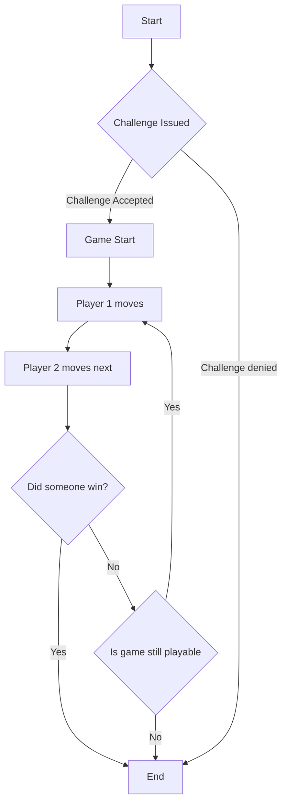

# Connect Four

Pallet to enable playing ConnectFour on the Substrate chain.

*Note*: This uses Substrate's FRAME `v4.0.0-dev`

## Configuration

While this pallet has been configured for use with this particular instance,
you can configure it as follows:

Add the following to the runtime's `Cargo.toml` file 

```toml
[dependencies]
# add this line somewhere in the dependencies section.
pallet-connect-four = { version = "1.0.0", default-features = false, path = "../pallets/connect-four" }
```

Declare the use of the pallet in `runtime/src/lib.rs`

```rust
// add this line
pub use pallet_connect_four;
```

Declare the parameter types for the configurable constants. This pallet has 3 configurables.

```rust
parameter_types! {
	pub const PointsForWin: u32 = 5;
	pub const PointsForLoss: u32 = 2;
	pub const PointsForDraw: u32 = 3;

}
impl pallet_connect_four::Config for Runtime {
	type Event = Event;
	type RandomnessSource = RandomnessCollectiveFlip;
	type PointsForWin = PointsForWin;
	type PointsForLoss = PointsForLoss;
	type PointsForDraw = PointsForDraw;
}
```

Add the following in the `construct_runtime!()` macro block.

```rust
  {
    // add this line
    ConnectFour: pallet_connect_four,
  }
```

Then, you can compile and execute the runtime using `Cargo`.


```bash
cargo run -- --dev --tmp
```

Or,

```bash

cargo build --release
./target/release/node-runtime --dev --tmp
```

## Testing

You can execute all the test cases for the game by entering the `pallets/connect-four` directory
and running `cargo test`.

The tests cover every testcase that the code accounts for, and they also serve a way to document
how the flow of the game works.

## Game Flow


